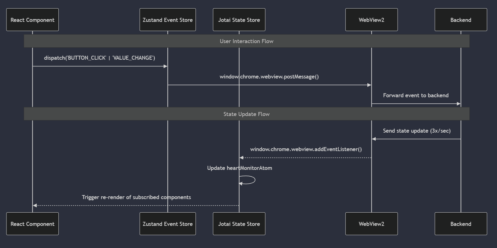

** Dataflow Diagram **

sequenceDiagram
    participant UI as React Component
    participant EventStore as Zustand Event Store
    participant StateStore as Jotai State Store
    participant WebView2
    participant Backend

    Note over UI,Backend: User Interaction Flow
    UI->>EventStore: dispatch('BUTTON_CLICK' | 'VALUE_CHANGE')
    EventStore->>WebView2: window.chrome.webview.postMessage()
    WebView2->>Backend: Forward event to backend

    Note over UI,Backend: State Update Flow
    Backend->>WebView2: Send state update (3x/sec)
    WebView2-->>StateStore: window.chrome.webview.addEventListener()
    StateStore->>StateStore: Update heartMonitorAtom
    StateStore-->>UI: Trigger re-render of subscribed components

    
